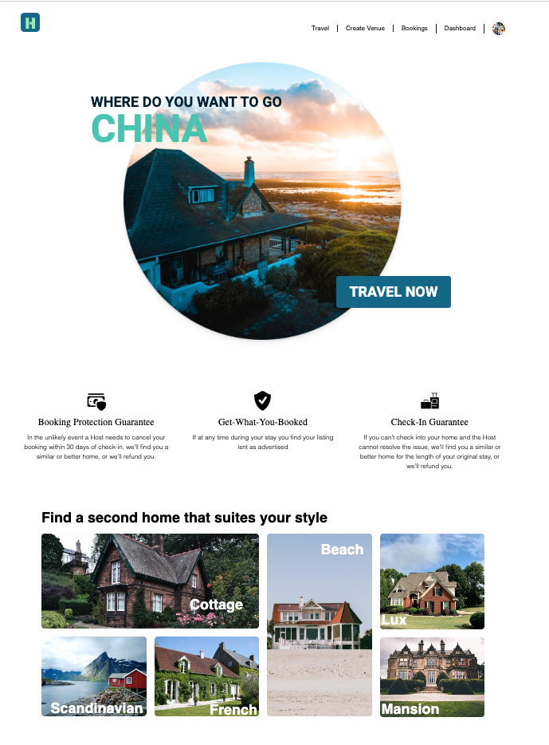

# Holidaze 🏠

Holidaze is a modern front-end accommodation booking application developed as a final exam project at Noroff School of Technology. The main objective of this project is to create a user-friendly platform similar to Airbnb, where users can easily search for various accommodation options and make bookings. Venue managers can also register on the platform to list and manage their own rental properties. The project utilizes an API provided by Noroff, which serves as the backend for data retrieval and storage. You can find the detailed API documentation [here](API_documentation_link). [here](https://noroff-api-docs.netlify.app/social-endpoints/posts).

## User Stories 👥

Holidaze was developed to cater to the following user stories
-🌐 Users can view a list of venues.

-🔍 Users can search for a specific venue.

-🏷️ Users can view a specific venue page by its ID.

-🗓️ Users can view a calendar with available dates for a venue.

-📧 Users with a noroff.no email can register as customers.

-✍️ Registered customers can create bookings at venues.

-📅 Registered customers can view their upcoming bookings.

-📧 Users with a stud.noroff.no email can register as venue managers.

-🏗️ Registered venue managers can create venues.

-🔄 Registered venue managers can update venues they manage.

-🗑️ Registered venue managers can delete venues they manage.

-👀 Registered venue managers can view bookings for venues they manage.

-🔐 Registered users can log in.

-🖼️ Registered users can update their avatars.

-🔓 Registered users can log out.

## Tech Stack ⚙️
This project was developed using the following technologies:

-📚 React for building the user interface.

-⚡ Vite as the build tool

-🎨 Tailwind CSS for styling.

-🖌️ Figma for designing the user interface.

-📈 GitHub Projects for planning and managing tasks.

-☁️ Netlify for hosting.

## Live Demo 🔗
You can visit the live demo of the project [here](https://holidaze-navy.vercel.app/).

## Getting Started 🚀
1.🍴 Fork the repository.

2.📂 Clone the forked repository to your local machine.

3.📝 Open the project in your favorite code editor.

4.🛠️ Run npm install in the project root directory to install the necessary dependencies.

5.🏃‍♀️ Run npm run dev to start the development server.

6. The project should now be running on localhost:3000 (or whichever port your environment is set up to use).

## Connect with Me 🤝
LinkedIn: [Sandra Bakken Møller Sørensen](https://www.linkedin.com/in/sandra-bakken-m%C3%B8ller-s%C3%B8rensen/)

Happy coding! 💻

